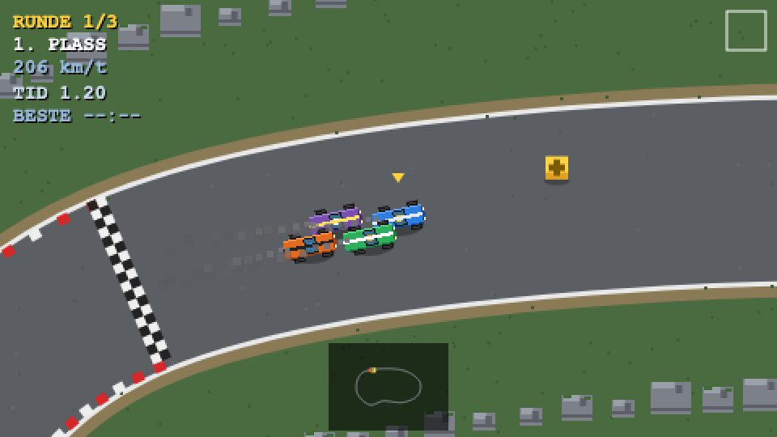

# Flåklypa Grand Prix

En pikselgrafikk-hyllest til det klassiske *Flåklypa Grand Prix*-bilspillet — top-down racing der du kjører mot AI-biler på en svingete bane, plukker opp gjenstander og kjemper om førsteplassen.

Bygget i ren **HTML5 Canvas + vanilla JavaScript** — ingen rammeverk, ingen byggetrinn. Bare åpne `index.html` i en nettleser.

## Spille

Åpne `index.html` direkte i nettleseren (dobbeltklikk eller dra den inn i et nytt faneblad). Ingen server nødvendig.

### Kontroller

| Tast | Spiller 1 | Spiller 2 |
|------|-----------|-----------|
| Gass | ↑ | W |
| Brems / rygg | ↓ | S |
| Styr | ← → | A D |
| Bruk gjenstand | Mellomrom | Venstre Shift |

Felles: **Esc** pause (Fortsett / Start på nytt / Til meny), **M** lyd av/på, **Enter** start/bekreft.

I menyen: **P** velger 1 eller 2 spillere, **←/→** velger bil for P1, **A/D** for P2, **L** antall runder, **K** vanskelighet.

## Funksjoner

- **To spillere på delt skjerm** — vertikal splitt med hvert sitt kamera og HUD; P1 på piltaster, P2 på WASD, pluss AI-motstandere.
- **Nordisk miljø** — bjørk-, furu- og granskog med varianter, tømmerhus, fjell og fjord som ytre grense.
- **Synlige barrierer og snarveier** — steinrekker langs banen med bevisste gap i svingene; gambling over gresset er tregere men kortere, og gresset får **hjulspor som blir tydeligere jo flere som kjører der**.
- **Taktiske hindringer** — olje og røyk rammer kun bilene bak, aldri den som bruker dem; oljesøl blir liggende lenge og mister gradvis effekt.
- **Top-down pikselgrafikk** — lav intern oppløsning (480×270) skalert opp med nearest-neighbor for skarp pixel art. All grafikk er prosedyre-generert (ingen bildefiler), inkludert pre-rendrede rotasjonsframes for knivskarpe biler.
- **3 valgbare biler** med ulik toppfart, veigrep og akselerasjon, og **distinkte AI-motstandere** med egne farger og navn.
- **Smart AI** med racinglinje, kurvatur-basert svingbremsing, stuck-recovery, subtil rubber-banding og strategisk gjenstandsbruk.
- **Power-ups:**
  - ⚡ **Fartsboost** — engangs-kick + midlertidig høyere toppfart.
  - 🛢️ **Oljesøl** — legges igjen bak deg; biler som treffer det mister grepet og sklir.
  - 💨 **Røyksky** — skjuler sikten og bremser bilene som kjører inn i den.
- **Arcade-fysikk** med veigrep og sleng — du mister grep på gress og olje.
- **Partikkeleffekter** — eksos, grus, dekkrøyk, gnister ved veggtreff, og persistente dekkspor på asfalten.
- **Syntetisert lyd (WebAudio, ingen lydfiler):** motor-drone som følger farten, dekkskrik, countdown-pip, boost/pickup/kollisjon-effekter og målfanfare.
- **3-2-1-GO-nedtelling**, **rundetider + beste runde**, kamera med lookahead, screen shake, plassering med over-/underkjørings-blink, minimap og **resultatskjerm** med alle tider og gap.
- **Menyvalg:** antall runder (3/5/7), vanskelighet (Lett/Normal/Vill) og lyd av/på — lagres mellom økter.
- **Røde/hvite kantsteiner** i svingene og høst-scenery (furuskog, løvtrær, røde låver, steiner).

## Teknisk

Spillet lastes som klassiske skript i `index.html` (fungerer fra `file://`):

| Fil | Ansvar |
|-----|--------|
| `js/config.js` | Konstanter (fysikk-tuning, banebredde, farger, kamera, balansering) |
| `js/assets.js` | Prosedyre-genererte piksel-sprites + rotasjonsframes (biler, dekor) |
| `js/specs.js` | Bil-specs + AI-liveries |
| `js/track.js` | Bane (Catmull-Rom-senterlinje), arc-lengde-progresjon, kurvatur, kantstein, skid-lag, for-rendret verdenskart |
| `js/car.js` | Arcade top-down-bilfysikk (spiller + AI), partikkel-emisjon, rundeprogresjon |
| `js/ai.js` | AI-styring (racinglinje, svingbremsing, stuck-recovery, rubber-band, gjenstandsbruk) |
| `js/powerups.js` | Pickup-bokser, oljesøl, røyksky, boost |
| `js/input.js` | Tastatur |
| `js/audio.js` | Syntetisert WebAudio-lydmotor (motor, dekkskrik, SFX, fanfare, demping) |
| `js/particles.js` | Partikkelsystem (eksos, grus, røyk, gnister) |
| `js/render.js` | All tegning + kamera + HUD + minimap + resultater |
| `js/main.js` | Spilløkke + tilstandsmaskin (meny → countdown → løp → mål) |

## Lisens

MIT
